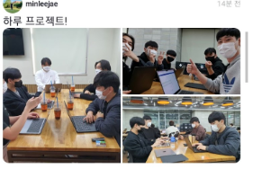
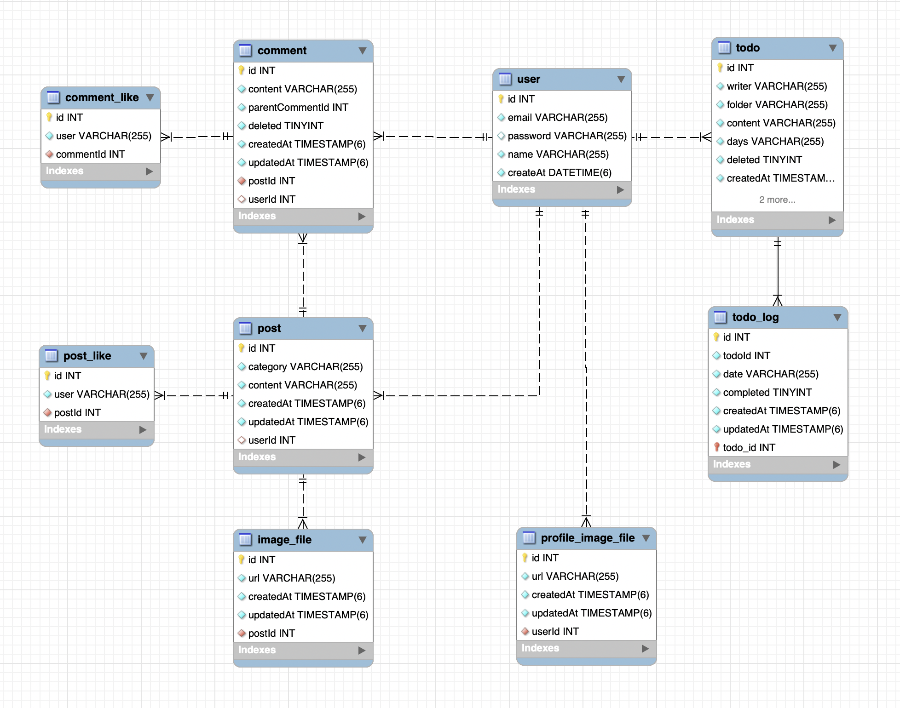

# 하루

하루를 계획하고 일상을 공유하는 공간, **하루**

# Project **Abstract**

계획을 정리하는 것은 많은 장점이 있습니다. 하지만 여러가지 이유로 계획을 정리하고 이행하지 않는 경우가 많습니다. 이러한 문제점을 해결하기 위해 하루는 서로의 일상을 공유하고 계획을 얼마나 잘 이행하였는지 통계를 보여줌으로써 사용자에게 동기를 부여하고자 합니다.

즉, **하루는 사람들의 일상에서 생산성있는 삶을 위해 동기를 부여해줄 수 있는 서비스를 제공**하고자 합니다.

# Team

- **Team Leader**  
  20191638 이민재

- **Team Members**  
  20191627 오홍석  
  20191630 유상록  
  20191668 정태성  
  20191679 최정민  

# Compile Environment

- **Compile SDK Version**  
32 (API 32: Android 12L)
- **Min SDK Version**  
31 (API 31: Android 12.0)
- **Source Compatibility**   
Java 11
- **Target Compatibility**  
Java 11
- **Android Gradle Plugin Version**  
7.2.2
- **Gradle Version**  
7.4

# Stacks
**Front-End**  


**Back-End**  


  
# Using Module

### Front-End

- retrofit
- kakao sdk
- okhttp
- swiperefreshlayout
- lottie animation

### Back-End

- bcrypt
- cookie-parser
- dotenv
- passport(jwt, local)
- jsonwebtoken

# Usage

- **Server**  
  - npm 또는 yarn 설치 후 진행
    - `npm install`
    - `yarn install`
  - MySQL 설치 및 haru 데이터베이스 추가
    - MySQL 설치
    - `CREATE DATABASE haru;`
  - 실행
    - `npm run start`
    - `yarn start`
- **Client**  
  안드로이드 스튜디오 실행 후 에뮬레이터 또는 안드로이드 기기로 앱 빌드 및 실행
- Server 최상위 폴더에서 .env 파일 생성


# Feature
<details open>
<summary>

### SNS

</summary>

- 이미지를 포함한 게시물을 업로드 할 수 있습니다.
- DB에서 데이터를 가져와 사용자에게 게시물을 보여줍니다.
- 게시물 업로드 시 DB에 저장합니다.
- 가져온 이미지의 갯수에 따라 미리보기 이미지 형식을 바꿔줬습니다.
  - 1개일 때 예시  
  
  - 2개일 때 예시  
  
  - 3개일 때 예시  
  
  
</details>

<details open>
<summary>

### Sign-Up

</summary>

- 사용자로부터 회원 정보를 입력받아 서버로 요청하여 DB에 저장합니다.
- Front
  1. 입력받은 회원 정보의 유효성 검사
     - 공백 확인
     - email 유효성 검사
     - password 동일성 검사
     - password 유효성 검사(영어 소문자, 숫자, 특수기호 조합, 8글자 이상)
     - 이름의 유효성 검사(영어, 한글)
  2. 유효성 검사 통과시 retrofit을 통한 서버 통신
- Server
  1. 전달받은 정보가 비었는지 확인
  2. DB에서 중복 이메일 검사
  3. bcrypt로 password hashing
  ```tsx
  bcrypt.genSalt(num, (err, salt) => {
        if (err) return res.status(500).send("비밀번호 해쉬화에 실패");

        bcrypt.hash(password, salt, async (err, hash) => {
          if (err) return res.status(500).send("비밀번호 해쉬화에 실패");
          password = hash;
  ```
  1. DB에 User 생성 후 저장
  
</details>

<details open>
<summary>

### Sign-In

</summary>

- 직접 생성한 계정을 통한 로그인
  - Front
    1. 입력받은 email, password 전송
    2. Server
    3. 이후 처리
       3-1. JWT
       - JWT를 preference에 저장
       - 이후 모든 요청에 JWT 탑재
       3-2. Error Message
       - “Bad Request” - 비밀번호를 다시 입력해주세요
       - “Not Found” - 존재하지 않는 이메일 입니다.
  - Server
    1. passport-local 전략
    2. DB에 해당 email 확인
    3. bcrypt 사용하여 password 확인
    4. DB에서 User Info 반환
    5. User Info 기반의 JWT 생성 후 반환
- Kakao-Login
  - Front
    1. 카카오톡에 계정 연결 여부
       1-1. Yes
       - kakao server로 로그인 요청
       1-2. No
       - 카카오 계정 입력 절차
       - kakao Server로 로그인 요청
    2. kakao server에서 Access Token 반환
    3. Server로 Access Token 전송
    4. Server
    5. 이후 처리
       - 다른 기능 사용을 위해 전역적으로 JWT 관리
  - Server
    1. Access Token을 kakao Server로 재차 확인 전송
    2. kakao Server에서 User Profile 반환
    3. User Profile 기반 정보가 DB에 있는지 확인
       - 없으면 Create
       - 있으면 Update
    4. User profile 기반의 JWT 생성 후 반환
- Logout
  - Front
    1. JWT를 Server로 전송
  - Server
    1. passport-jwt 전략
       - JWT 없으면 Error Message 반환
       - JWT 있으면 JWT에서 정보 추출
    2. 모든 쿠키 삭제
    3. 결과값 반환
    
</details>

<details open>
<summary>

### Todo-List

</summary>

- 사용자의 Todo 데이터를 폴더별로 또는 여러가지 필터 방식으로 정렬하여 보여줍니다.
- 사용자의 Todo 데이터를 입력받아 DB에 저장합니다.
- Todo 데이터 업데이트, 삭제, 완료와 같은 기능을 지원합니다.

</details>


<details open>
<summary>

### Calendar

</summary>

- 어플이 실행될 때 DB에서 데이터를 가져옵니다.
- DB에서 가져온 데이터를 가공하여 maindata 클래스에 저장합니다.
- maindata를 사용하여 캘린더를 불러올 때 데이터 삽입합니다.
- 월간
  월간은 실제 달력을 모델로 삼은 레이아웃이고
  슬라이드로 다음 달 달력으로 넘어갈 수 있습니다.
  원하는 날짜 클릭시 메시지창으로 그 날의 상세일정을 나타내 줍니다.
- 주간
  주간도 월간과 마찬가지로 가공한 데이터를 사용하고
  월간과 다르게 날짜를 클릭했을 때만 그 날의 일정을
  게시판에 불러옵니다.
  
</details>

<details open>
<summary>

### Statistics

</summary>

- maindata 클래스의 데이터를 가져와서 성공률을 계산합니다.
- RecyclerView를 사용한 잔디와 프로그레스바로 레이아웃을 구성하였습니다.
- 그 날의 성공한 계획이 하나라도 있으면 그 날 잔디의 색깔을 바꿉니다.
- 오늘의 성공률, 이번주 성공률, 이번달 성공률을 계산하여 프로그레스바로
  퍼센트 게이지와 함께 나타냅니다.

</details>

   
   
# Database Schema
<details open>
<summary>
전체 데이터베이스 스키마 구조도입니다.

</summary>

  
- **user**  
사용자의 이메일, 비밀번호, 이름을 저장하는데 사용합니다.  
추가로 sns와 todo 데이터를 저장하는데 사용됩니다.
- **post**  
sns게시물의 카테고리와 내용 정보를 저장합니다.
- **post_like**  
sns 게시물의 좋아요 개수를 저장하기 위해 좋아요를 누른 사용자의 id를 저장합니다.
- **image_file**  
게시물에 존재하는 이미지 파일의 aws s3 url을 저장합니다.
- **comment**  
sns 게시물에 작성된 댓글의 작성자와 내용 정보를 저장합니다.
- **comment_like**  
sns 게시물의 댓글의 좋아요 개수를 저장하기 위해 좋아요를 누른 사용자의 id를 저장합니다.
- **todo**  
사용자가 할 일을 추가하여 할 일의 내용과 날짜 정보를 저장합니다.
- **todo_log**  
todo에 종속적으로 사용자가 할 일을 완료했는지 여부를 저장합니다.
</details>
